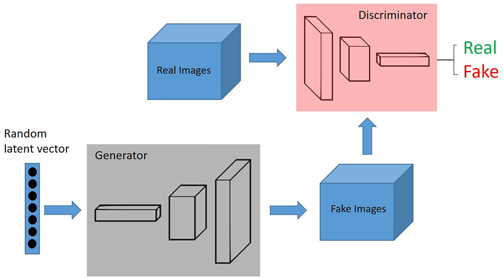
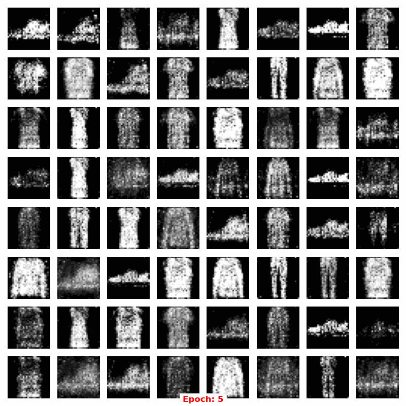
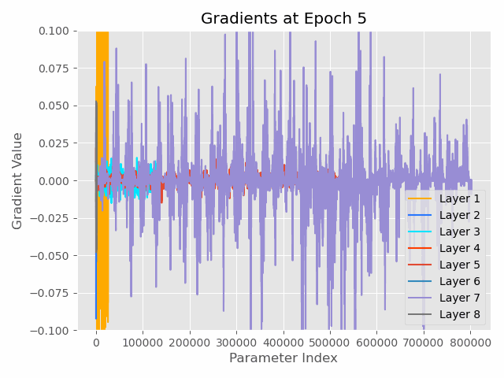
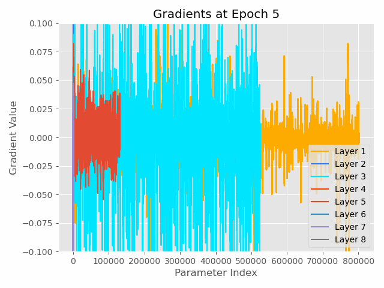
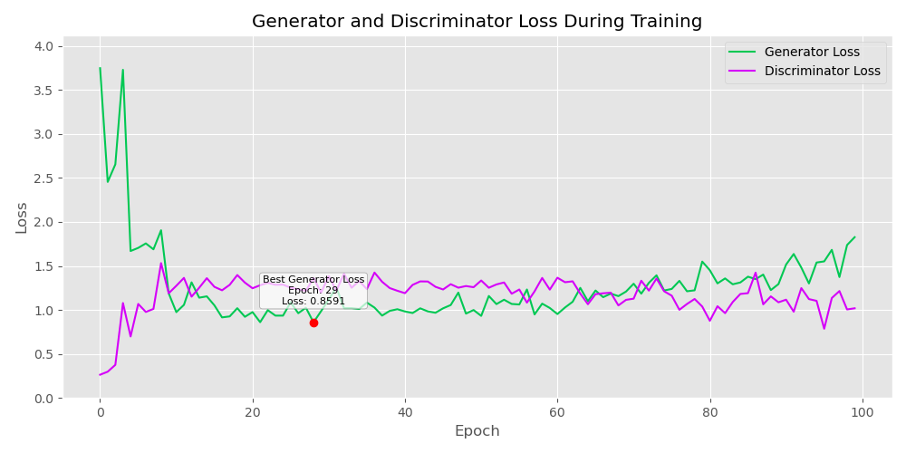
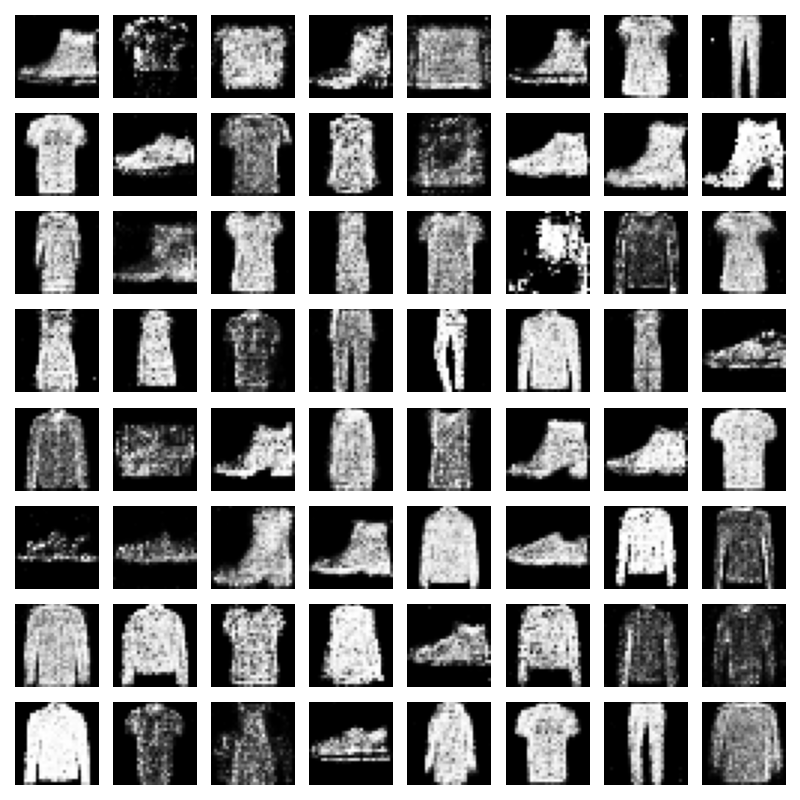

# Redes Adversariais Generativas (GANs): Histórico, Estrutura e Aplicações

As Redes Adversariais Generativas (GANs) surgiram como uma inovação revolucionária no campo da inteligência artificial e aprendizado de máquina. Introduzidas por Ian Goodfellow e seus colegas em 2014, as GANs rapidamente se destacaram por sua capacidade de gerar dados realistas a partir de entradas aleatórias. Exploraremos o histórico de desenvolvimento das GANs, suas estruturas principais e algumas de suas diversas aplicações.

<em>Representação de uma GAN</em>

## Histórico de Desenvolvimento

As GANs foram apresentadas pela primeira vez em um artigo de pesquisa intitulado "Generative Adversarial Networks" por Ian Goodfellow e colegas na conferência NeurIPS em 2014 [^1].

A ideia central era treinar dois modelos simultaneamente: um gerador, que cria dados falsos, e um discriminador, que tenta distinguir entre dados reais e falsos. Este processo adversarial leva ambos os modelos a se aprimorarem mutuamente, resultando em um gerador capaz de criar dados extremamente realistas.

Desde sua introdução, as GANs passaram por diversas melhorias e variações, como [DCGANs (Deep Convolutional GANs)](#dcgans-deep-convolutional-generative-adversarial-networks), [WGANs (Wasserstein GANs)](#wgans-wasserstein-generative-adversarial-networks), e [CycleGANs](#cyclegans-cycle-consistent-generative-adversarial-networks), cada uma com suas próprias inovações e aplicações específicas. Essas variações ampliaram ainda mais o alcance e a eficácia das GANs em diversas áreas.

## Estrutura das GANs

A estrutura básica de uma GAN consiste em duas redes neurais principais:

1. **[Gerador](#rede-neural-do-gerador) (Generator)**: Esta rede neural toma uma entrada aleatória (geralmente um vetor de ruído) e a transforma em dados falsos, que tenta fazer passar como dados reais. O objetivo do gerador é enganar o discriminador.

2. **[Discriminador](#rede-neural-do-discriminador) (Discriminator)**: Esta rede neural recebe tanto dados reais quanto dados falsos do gerador e tenta distinguir entre os dois. O discriminador é treinado para classificar corretamente os dados como reais ou falsos.

O processo de treinamento das GANs é um jogo de soma zero onde o gerador tenta maximizar a probabilidade do discriminador cometer um erro, enquanto o discriminador tenta minimizar essa probabilidade. Em termos matemáticos, isso é frequentemente representado como um problema de *minimax optimization*.

### O Problema Minimax

O treinamento de uma GAN é formulado como um problema de otimização minimax entre o gerador e o discriminador. A função de perda original proposta por Goodfellow é:

$$
\min_G \max_D V(D, G) = \mathbb{E}_{\mathbf{x} \sim p_{\text{data}}(\mathbf{x})} [\log D(\mathbf{x})] + \mathbb{E}_{\mathbf{z} \sim p_{\mathbf{z}}(\mathbf{z})} [\log (1 - D(G(\mathbf{z})))]
$$

Onde:
- $G$ é o gerador, que mapeia um vetor de ruído $\mathbf{z}$ para a distribuição dos dados $G(\mathbf{z})$.
- $D$ é o discriminador, que estima a probabilidade de uma amostra $\mathbf{x}$ ser real.
- $p_{\text{data}}(\mathbf{x})$ é a distribuição real dos dados.
- $p_{\mathbf{z}}(\mathbf{z})$ é a distribuição de ruído (normalmente uma distribuição uniforme ou normal).

O objetivo do gerador **G** é maximizar a probabilidade do discriminador **D** cometer um erro ao classificar uma amostra gerada como real. O discriminador, por sua vez, tenta maximizar sua precisão na classificação correta das amostras reais e geradas. Este jogo adversarial continua até que um equilíbrio de [Nash](#equilíbrio-de-nash)[^9] seja alcançado, onde nenhum dos jogadores (gerador ou discriminador) pode melhorar sua estratégia sem alterar a do outro.

## Composição das Redes Neurais do Gerador e do Discriminador

### Rede Neural do Gerador

A rede neural do Gerador (Generator) tem como objetivo gerar dados sintéticos que sejam indistinguíveis dos dados reais. A arquitetura típica do Gerador inclui:

1. **Camada de Entrada**: Um vetor de ruído aleatório $\mathbf{z}$ é fornecido como entrada. Esse vetor geralmente segue uma distribuição normal ou uniforme.

2. **Camadas Ocultas**: Essas camadas são compostas por uma série de camadas densas (fully connected layers) ou camadas convolucionais transpostas (transposed convolutional layers), também conhecidas como camadas deconvolucionais. Cada camada é geralmente seguida por uma função de ativação não linear, como ReLU (Rectified Linear Unit) ou Leaky ReLU. As camadas deconvolucionais são usadas para aumentar a dimensionalidade dos dados ao longo da rede.

3. **Camada de Saída**: A última camada do Gerador produz os dados sintéticos. Se a tarefa for gerar imagens, essa camada terá uma ativação tanh para normalizar os valores de pixel entre -1 e 1.

### Rede Neural do Discriminador

A rede neural do Discriminador (Discriminator) tem como objetivo classificar os dados como reais ou falsos. A arquitetura típica do Discriminador inclui:

1. **Camada de Entrada**: Recebe os dados de entrada, que podem ser tanto reais quanto gerados pelo Gerador. Para imagens, a entrada é geralmente uma matriz 2D de pixels.

2. **Camadas Ocultas**: Essas camadas são compostas por uma série de camadas convolucionais, que reduzem a dimensionalidade dos dados e extraem características relevantes. Cada camada é seguida por uma função de ativação não linear, como Leaky ReLU, e, em alguns casos, por normalização de lote (batch normalization).

3. **Camada de Saída**: A última camada do Discriminador é uma camada densa que produz uma única probabilidade usando uma função de ativação sigmoid. Essa probabilidade indica a confiança do Discriminador de que a entrada é real.

## WGANs (Wasserstein Generative Adversarial Networks)

As Wasserstein Generative Adversarial Networks (WGANs) são uma classe de Redes Adversariais Generativas (GANs) que utilizam a [distância de Wasserstein](#distância-de-wasserstein) como métrica para medir a dissimilaridade entre a distribuição dos dados reais e a distribuição dos dados gerados. Introduzidas por Martin Arjovsky, Soumith Chintala e Léon Bottou em 2017 [^2], as WGANs foram projetadas para melhorar a estabilidade do treinamento e fornecer gradientes mais informativos.

### Motivação e Problemas das GANs Tradicionais

As GANs tradicionais, baseadas na divergência de Jensen-Shannon, podem sofrer de instabilidade no treinamento e problemas de *vanishing gradients* ou *exploding gradients*, especialmente quando as distribuições reais e geradas não se sobrepõem significativamente.

### Estrutura das WGANs

As WGANs seguem a estrutura básica das GANs, composta por um gerador e um discriminador (também chamado de "critic" em WGANs), mas utilizam a distância de Wasserstein como função de perda. A principal diferença está na maneira como a função de perda é formulada e nos métodos utilizados para garantir que o critic satisfaça a condição de [Lipschitz](#função-lipschitz).

### Função de Perda das WGANs

A função de perda das WGANs é baseada na distância de Wasserstein de ordem 1:

$$ \min_G \max_{D \in \mathcal{D}} \mathbb{E}_{\mathbf{x} \sim p_{\text{data}}(\mathbf{x})} [D(\mathbf{x})] - \mathbb{E}_{\mathbf{z} \sim p_{\mathbf{z}}(\mathbf{z})} [D(G(\mathbf{z}))] $$

onde:
- $ G $ é o gerador que mapeia um vetor de ruído $ \mathbf{z} $ para a distribuição dos dados gerados $ G(\mathbf{z}) $.
- $ D $ é o critic que estima a "qualidade" dos dados, e $ \mathcal{D} $ é o conjunto de funções $ 1 $-Lipschitz.

### Garantindo a Condição de Lipschitz

Para garantir que o critic $ D $ seja uma função $ 1 $-Lipschitz, as WGANs introduzem duas técnicas principais:

1. **Corte de Peso (Weight Clipping)**: Inicialmente, Arjovsky et al.[^2] propuseram cortar os pesos do critic para um intervalo fixo $[-c, c]$. Isso, no entanto, pode levar a problemas de otimização e limitar a capacidade de aprendizado do critic.

$$ W \leftarrow \text{clip}(W, -c, c) $$

2. **Penalidade de Gradiente (Gradient Penalty)**: Uma técnica posterior e mais eficaz é a penalidade de gradiente, proposta por Gulrajani et al. em 2017 [^7]. Esta técnica adiciona um termo à função de perda que penaliza desvios da norma do gradiente em relação a 1.

$$ \mathcal{L} = \mathbb{E}_{\mathbf{x} \sim p_{\text{data}}(\mathbf{x})} [D(\mathbf{x})] - \mathbb{E}_{\mathbf{z} \sim p_{\mathbf{z}}(\mathbf{z})} [D(G(\mathbf{z}))] + \lambda \mathbb{E}_{\hat{\mathbf{x}} \sim p_{\hat{\mathbf{x}}}(\hat{\mathbf{x}})} \left[ (\|\nabla_{\hat{\mathbf{x}}} D(\hat{\mathbf{x}})\|_2 - 1)^2 \right] $$

onde $ \hat{\mathbf{x}} $ são amostras interpoladas entre dados reais e gerados, e $ \lambda $ é um coeficiente de penalidade.

### Principais Diferenças das WGANs

1. **Distância de Wasserstein**: As WGANs utilizam a distância de Wasserstein em vez da divergência de Jensen-Shannon, fornecendo uma medida mais suave e significativa da dissimilaridade entre as distribuições.
2. **Gradientes Estáveis**: A função de perda da WGAN fornece gradientes mais estáveis e informativos, melhorando a convergência do treinamento.
3. **Condicionamento de Lipschitz**: A imposição de que o critic seja uma função $ 1 $-Lipschitz, inicialmente por corte de peso e depois por penalidade de gradiente, ajuda a evitar problemas de *exploding gradients* ou *vanishing gradients*.

---

## DCGANs (Deep Convolutional Generative Adversarial Networks)

As DCGANs (Deep Convolutional Generative Adversarial Networks) são uma classe de Redes Adversariais Generativas (GANs) que utilizam redes neurais convolucionais profundas para melhorar a estabilidade e a qualidade da geração de imagens. Introduzidas por Alec Radford, Luke Metz e Soumith Chintala em 2015 [^8], as DCGANs se destacam pela sua arquitetura que explora as capacidades das redes convolucionais para capturar e gerar características visuais detalhadas.

### Estrutura das DCGANs

As DCGANs seguem a estrutura básica das GANs, composta por um gerador e um discriminador, mas utilizam camadas convolucionais e convolucionais transpostas no lugar das camadas densas tradicionais.

#### Gerador

O gerador nas DCGANs mapeia um vetor de ruído aleatório $ \mathbf{z} $ em uma imagem. A arquitetura típica do gerador inclui:

1. **Camada de Entrada**: Vetor de ruído $ \mathbf{z} $ (geralmente amostrado de uma distribuição normal).
2. **Camadas Convolucionais Transpostas**: Essas camadas aumentam a resolução da imagem de forma progressiva, com funções de ativação ReLU e normalização de lote (batch normalization) aplicadas em cada camada.
3. **Camada de Saída**: Camada convolucional transposta com ativação tanh para normalizar os valores de pixel entre -1 e 1.

Equação representativa de uma camada convolucional transposta:

$$ \text{ConvTransp}(x) = W * x + b $$

onde $ * $ denota a operação de convolução transposta, $ W $ são os pesos e $ b $ são os vieses.

#### Discriminador

O discriminador nas DCGANs é uma rede convolucional que classifica as imagens como reais ou geradas. A arquitetura típica do discriminador inclui:

1. **Camada de Entrada**: Imagem de entrada (real ou gerada).
2. **Camadas Convolucionais**: Essas camadas reduzem a resolução da imagem de forma progressiva, com funções de ativação Leaky ReLU e normalização de lote (batch normalization) aplicadas em cada camada.
3. **Camada de Saída**: Camada totalmente conectada com ativação sigmoid para produzir uma probabilidade entre 0 e 1, indicando se a imagem é real ou falsa.

Equação representativa de uma camada convolucional:

$$ \text{Conv}(x) = W * x + b $$

onde $ * $ denota a operação de convolução, $ W $ são os pesos e $ b $ são os vieses.

### Principais Diferenças das DCGANs

1. **Camadas Convolucionais**: Ao contrário das GANs tradicionais que usam camadas densas, as DCGANs utilizam camadas convolucionais e convolucionais transpostas, que são mais adequadas para capturar e gerar características visuais em dados de imagem.

2. **Normalização de Lote**: A aplicação da normalização de lote (batch normalization) em quase todas as camadas do gerador e do discriminador ajuda a estabilizar o treinamento e a evitar problemas como o colapso de modos.

3. **Funções de Ativação**: O uso de ReLU no gerador e Leaky ReLU no discriminador contribui para a estabilidade do treinamento e melhora a qualidade das imagens geradas.

4. **Arquitetura Profunda**: As DCGANs utilizam arquiteturas mais profundas com mais camadas, permitindo a captura de padrões complexos nas imagens.

---

## CycleGANs (Cycle-Consistent Generative Adversarial Networks)

As Cycle-Consistent Generative Adversarial Networks (CycleGANs) são uma classe de Redes Adversariais Generativas (GANs) projetadas para a tradução de imagem-para-imagem sem a necessidade de pares de imagens correspondentes no treinamento. Introduzidas por Jun-Yan Zhu, Taesung Park, Phillip Isola e Alexei A. Efros em 2017 [^10], as CycleGANs são amplamente utilizadas em tarefas como transferência de estilo, mapeamento de domínios e alteração de atributos de imagens.

### Motivação e Problemas das GANs Tradicionais

As GANs tradicionais para tradução de imagem-para-imagem, como as Pix2Pix GANs, requerem pares de imagens correspondentes para treinamento. Isso limita seu uso a domínios onde esses pares estão disponíveis, o que não é prático em muitos cenários. As CycleGANs superam essa limitação ao aprender a traduzir entre domínios sem a necessidade de pares correspondentes, utilizando a consistência cíclica como uma restrição.

### Estrutura das CycleGANs

As CycleGANs consistem em dois pares de geradores e discriminadores:

1. $ G_{AB} $: Gerador que traduz imagens do domínio $ A $ para o domínio $ B $.
2. $ G_{BA} $: Gerador que traduz imagens do domínio $ B $ para o domínio $ A $.
3. $ D_A $: Discriminador que diferencia imagens reais do domínio $ A $ das imagens geradas por $ G_{BA} $.
4. $ D_B $: Discriminador que diferencia imagens reais do domínio $ B $ das imagens geradas por $ G_{AB} $.

### Funções de Perda das CycleGANs

As CycleGANs utilizam duas principais funções de perda: a perda adversarial e a perda de consistência cíclica.

#### Perda Adversarial

As perdas adversariais são utilizadas para garantir que as imagens geradas sejam indistinguíveis das imagens reais:

$$ \mathcal{L}_{GAN}(G_{AB}, D_B, A, B) = \mathbb{E}_{y \sim p_{data}(y)} [\log D_B(y)] + \mathbb{E}_{x \sim p_{data}(x)} [\log (1 - D_B(G_{AB}(x)))] $$

$$ \mathcal{L}_{GAN}(G_{BA}, D_A, B, A) = \mathbb{E}_{x \sim p_{data}(x)} [\log D_A(x)] + \mathbb{E}_{y \sim p_{data}(y)} [\log (1 - D_A(G_{BA}(y)))] $$

#### Perda de Consistência Cíclica

A perda de consistência cíclica assegura que uma imagem traduzida de um domínio para outro e depois de volta para o domínio original seja semelhante à imagem original:

$$ \mathcal{L}_{cyc}(G_{AB}, G_{BA}) = \mathbb{E}_{x \sim p_{data}(x)} [\| G_{BA}(G_{AB}(x)) - x \|_1] + \mathbb{E}_{y \sim p_{data}(y)} [\| G_{AB}(G_{BA}(y)) - y \|_1] $$

### Função de Perda Total

A função de perda total é a soma ponderada das perdas adversariais e da perda de consistência cíclica:

$$ \mathcal{L}(G_{AB}, G_{BA}, D_A, D_B) = \mathcal{L}_{GAN}(G_{AB}, D_B, A, B) + \mathcal{L}_{GAN}(G_{BA}, D_A, B, A) + \lambda \mathcal{L}_{cyc}(G_{AB}, G_{BA}) $$

onde $ \lambda $ é um hiperparâmetro que controla a importância da perda de consistência cíclica.

### Principais Diferenças das CycleGANs

1. **Consistência Cíclica**: A principal inovação das CycleGANs é a introdução da perda de consistência cíclica, que permite a tradução de imagem-para-imagem sem pares correspondentes.
2. **Dois Pares de Geradores e Discriminadores**: Ao contrário das GANs tradicionais, as CycleGANs utilizam dois geradores e dois discriminadores para aprender as mapeações bidirecionais entre dois domínios.
3. **Treinamento Não Supervisionado**: As CycleGANs podem ser treinadas sem a necessidade de pares correspondentes de imagens, tornando-as aplicáveis a uma ampla variedade de cenários onde tais pares não estão disponíveis.

---

## Aplicações das GANs

As GANs têm uma ampla gama de aplicações práticas, algumas das quais incluem:

### 1. **Criação de Imagens Realistas**

Uma das aplicações mais conhecidas das GANs é a geração de imagens realistas. Modelos como DCGANs foram usados para criar imagens de rostos humanos que são indistinguíveis de fotos reais. Empresas como NVIDIA têm utilizado GANs para gerar imagens de alta resolução para uso em gráficos de computador e jogos.

### 2. **Melhoria de Imagens**

GANs são usadas para super-resolução de imagens, ou seja, aumentar a resolução de imagens de baixa qualidade. Isso tem aplicações em áreas como restauração de fotografias antigas, medicina (melhoria de imagens de radiografias) e segurança (melhoria de imagens de câmeras de vigilância).

### 3. **Transferência de Estilo**

As GANs, especialmente as CycleGANs, são usadas para a transferência de estilo, onde uma imagem em um estilo (por exemplo, uma foto) é transformada para parecer que está em outro estilo (por exemplo, uma pintura). Isso tem aplicações em arte digital, moda e design.

### 4. **Criação de Dados Sintéticos**

A criação de dados sintéticos é uma das aplicações mais impactantes das GANs, especialmente em áreas onde a coleta de dados reais é limitada, cara ou eticamente complexa. Aqui estão alguns exemplos avançados de como isso ocorre na indústria:

#### **a. Indústria de Saúde**

Na pesquisa médica, a obtenção de grandes volumes de dados de pacientes pode ser desafiadora devido a questões de privacidade e consentimento. GANs podem gerar dados sintéticos, como imagens de ressonância magnética (MRI) ou tomografias computadorizadas (CT), que são usadas para treinar modelos de aprendizado de máquina sem comprometer a privacidade dos pacientes. Estudos demonstraram que esses dados sintéticos podem melhorar a precisão dos diagnósticos assistidos por IA, especialmente em áreas como detecção de câncer e análise de imagens patológicas [^5].

#### **b. Setor Financeiro**

No setor financeiro, dados históricos de transações são críticos para desenvolver modelos de detecção de fraudes e análise de risco. No entanto, compartilhar esses dados entre instituições pode ser problemático devido a regulamentos de privacidade. GANs são usadas para criar transações sintéticas que mantêm as características estatísticas dos dados reais sem revelar informações sensíveis. Isso permite que diferentes instituições financeiras compartilhem e analisem dados de maneira segura e eficiente [^6].

#### **c. Automação e Condução Autônoma**

Para o desenvolvimento de veículos autônomos, é necessário um grande volume de dados de diferentes cenários de condução. GANs são utilizadas para gerar cenários sintéticos, como condições climáticas adversas ou situações de tráfego raras, que são difíceis de capturar em testes reais. Esses dados sintéticos são então usados para treinar e testar sistemas de condução autônoma, garantindo que os veículos possam lidar com uma ampla variedade de situações.

#### **d. Treinamento de Sistemas de Segurança**

Em segurança cibernética, GANs podem ser usadas para gerar tráfegos de rede sintéticos que imitam comportamentos maliciosos. Esses dados são usados para treinar sistemas de detecção de intrusões e outros mecanismos de segurança, permitindo que eles reconheçam e respondam a ataques de maneira mais eficaz. A geração de tráfegos de rede sintéticos também permite a realização de testes de penetração e avaliação de segurança em um ambiente controlado e seguro.

---

## Exemplo Prático com PyTorch

O repositório com todos os códigos e imagens estão disponíveis [neste link](https://github.com/luizsouzars/gans.git).

#### Parâmetros:
- epochs: 100
- batch_size: 64
- learning_rate: 0.0002

Durante o treinamento do modelo gerados, buscamos salvar aquele com menor Loss dentre todas as épocas. Este, foi considerado o melhor modelo e salvo para uso na geração de um conjunto de imagens sintéticas.

#### Estrutura da Rede do Gerador

Entrada:

1. Um vetor de ruído nz (normalmente uma distribuição gaussiana).

Camadas:

1. **nn.Linear(nz, 256):** Camada linear que mapeia o vetor de ruído para 256 neurônios.
2. **nn.BatchNorm1d(256):** Normalização em batch para estabilizar o treinamento.
3. **nn.ReLU(True):** Função de ativação ReLU.
4. **nn.Linear(256, 512):** Camada linear que mapeia 256 neurônios para 512 neurônios.
5. **nn.BatchNorm1d(512):** Normalização em batch.
6. **nn.ReLU(True):** Função de ativação ReLU.
7. **nn.Linear(512, 1024):** Camada linear que mapeia 512 neurônios para 1024 neurônios.
8. **nn.BatchNorm1d(1024):** Normalização em batch.
9. **nn.ReLU(True):** Função de ativação ReLU.
10. **nn.Linear(1024, image_size * image_size):** Camada linear que mapeia 1024 neurônios para o tamanho da imagem.
11. **nn.Tanh():** Função de ativação Tanh para manter os valores da imagem entre -1 e 1.

Saída:

1. Uma imagem gerada de tamanho (image_size, image_size).

#### Estrutura da Rede do Gerador

Entrada:
1. Uma imagem de tamanho (image_size, image_size).

Camadas:
1. **nn.Linear(image_size * image_size, 1024):** Camada linear que mapeia a imagem para 1024 neurônios.
2. **nn.LeakyReLU(0.2, inplace=True):** Função de ativação LeakyReLU.
3. **nn.Linear(1024, 512):** Camada linear que mapeia 1024 neurônios para 512 neurônios.
4. **nn.LeakyReLU(0.2, inplace=True):** Função de ativação LeakyReLU.
5. **nn.Linear(512, 256):** Camada linear que mapeia 512 neurônios para 256 neurônios.
6. **nn.LeakyReLU(0.2, inplace=True):** Função de ativação LeakyReLU.
7. **nn.Linear(256, 1):** Camada linear que mapeia 256 neurônios para 1 neurônio.
8. **nn.Sigmoid():** Função de ativação Sigmoid para obter uma probabilidade.

Saída:
1. Uma probabilidade de que a imagem seja real ou falsa.

#### Imagens de treinamento

<em>Imagens geradas durante o treinamento</em>

<em>Evolução dos gradientes do gerador</em>

<em>Evolução dos gradientes do discriminador</em>

<em>Loss de treinamento</em>

#### Conjunto de Imagens Sintéticas Geradas pelo Modelo Treinado

<em>Imagens Sintéticas Geradas pelo Modelo Treinado</em>

---

## Distância de Wasserstein

A distância de Wasserstein, também conhecida como distância de Earth-Mover, é uma métrica usada para medir a dissimilaridade entre duas distribuições de probabilidade. Ela é amplamente utilizada em várias áreas, incluindo teoria de transporte ótimo, economia e, mais recentemente, em aprendizado de máquina, especialmente em Wasserstein GANs (WGANs) para melhorar a estabilidade do treinamento.

### Definição Formal

A distância de Wasserstein de ordem 1 entre duas distribuições de probabilidade $ P $ e $ Q $ em um espaço métrico $(X, d)$ é definida como:

$$
W_1(P, Q) = \inf_{\gamma \in \Pi(P, Q)} \mathbb{E}_{(x,y) \sim \gamma} [d(x,y)]
$$

onde:
- $\Pi(P, Q)$ é o conjunto de todas as distribuições conjuntas $\gamma(x, y)$ cujas marginais são $ P $ e $ Q $ respectivamente.
- $ d(x, y) $ é a métrica do espaço $ X $ que mede a distância entre os pontos $ x $ e $ y $.

### Intuição

A distância de Wasserstein pode ser intuitivamente entendida como o custo mínimo necessário para transformar uma distribuição em outra. Imagine duas distribuições como pilhas de terra; a distância de Wasserstein é a quantidade mínima de "trabalho" necessária para mover a terra de uma pilha para formar a outra, onde o trabalho é definido como a quantidade de terra movida multiplicada pela distância que ela é movida.

### Aplicação em GANs

No contexto das Wasserstein GANs (WGANs), a distância de Wasserstein é usada como uma métrica de dissimilaridade entre a distribuição dos dados reais e a distribuição dos dados gerados. A função de perda da WGAN é baseada na distância de Wasserstein, o que proporciona gradientes mais informativos e estáveis durante o treinamento. A função de perda da WGAN é definida como:

$$
\min_G \max_{D \in \mathcal{D}} \mathbb{E}_{\mathbf{x} \sim p_{\text{data}}(\mathbf{x})} [D(\mathbf{x})] - \mathbb{E}_{\mathbf{z} \sim p_{\mathbf{z}}(\mathbf{z})} [D(G(\mathbf{z}))]
$$

### Vantagens da Distância de Wasserstein

- **Estabilidade do Treinamento**: A distância de Wasserstein fornece gradientes significativos mesmo quando o gerador e o discriminador não se sobrepõem significativamente, evitando o problema de *vanishing gradients*.
- **Convergência Melhorada**: WGANs tendem a ter uma convergência mais estável e uma melhor qualidade das amostras geradas em comparação com as GANs tradicionais.

---

## Função Lipschitz

No campo da análise matemática, a continuidade de funções é um conceito central. Uma função é dita ser **Lipschitz contínua** se houver uma constante que limita a taxa de variação da função. Este conceito é útil em diversas áreas da matemática aplicada, incluindo a teoria das redes neurais e, especificamente, em GANs para assegurar a estabilidade do treinamento.

### Definição Formal

Uma função $f: \mathbb{R}^n \to \mathbb{R}$ é chamada de Lipschitz contínua se existe uma constante $K \geq 0$ tal que, para todos $x_1, x_2 \in \mathbb{R}^n$,

$\|f(x_1) - f(x_2)\| \leq K \|x_1 - x_2\|$

onde $\| \cdot \|$ denota uma norma (geralmente a norma euclidiana).

A menor constante $K$ que satisfaz esta condição é chamada de **constante de Lipschitz** de $f$. Se $K$ for pequeno, a função muda lentamente, enquanto um $K$ grande permite mudanças rápidas na função.

### Intuição

Intuitivamente, a condição de Lipschitz significa que a função $f$ não pode oscilar ou variar mais rapidamente do que uma taxa linear determinada pela constante $K$. Isso garante que pequenas mudanças na entrada resultem em mudanças controladas na saída, evitando comportamentos erráticos.

### Aplicação em GANs

No contexto das GANs, a condição de Lipschitz é usada para garantir a estabilidade do discriminador, especialmente em WGANs. A função de perda da WGAN requer que o discriminador (ou crítico) seja uma função 1-Lipschitz. Isso significa que, para todos $x_1, x_2$,

$\|D(x_1) - D(x_2)\| \leq \\|x_1 - x_2\\|$

Para impor essa condição, técnicas como corte de peso (weight clipping) ou penalidades de gradiente (gradient penalty) são aplicadas durante o treinamento.

### Penalidade de Gradiente

Uma abordagem comum para assegurar a condição de Lipschitz é adicionar uma penalidade de gradiente à função de perda. Esta penalidade é definida como:

$$
\mathbb{E}_{\hat{x} \sim p_{\hat{x}}} \left[(\|\nabla_{\hat{x}} D(\hat{x})\|_2 - 1)^2 \right]
$$

onde $\hat{x}$ são amostras interpoladas entre dados reais e gerados. Esta penalidade força o gradiente do discriminador a ser próximo de 1, ajudando a manter a função dentro da condição de 1-Lipschitz.

### Importância na Estabilidade de GANs

Garantir que o discriminador seja uma função Lipschitz é crucial para a estabilidade do treinamento em GANs. Sem essa condição, os gradientes podem explodir ou desaparecer, levando a um treinamento instável e à geração de amostras de baixa qualidade.

---

## Equilíbrio de Nash

O conceito de equilíbrio de Nash, nomeado em homenagem ao matemático John Nash, é um conceito fundamental na teoria dos jogos. Um equilíbrio de Nash ocorre quando, em um jogo envolvendo dois ou mais jogadores, cada jogador escolhe a melhor estratégia para si mesmo, considerando as estratégias dos outros jogadores. Em outras palavras, no equilíbrio de Nash, nenhum jogador pode melhorar seu resultado mudando unilateralmente sua estratégia.

### Definição Formal

Em um jogo com $n$ jogadores, seja $S_i$ o conjunto de estratégias possíveis para o jogador $i$ e $u_i(s_1, s_2, \ldots, s_n)$ a função utilidade (payoff) do jogador $i$ quando os jogadores escolhem as estratégias $s_1, s_2, \ldots, s_n$, respectivamente. Um perfil de estratégia $(s_1^\*, s_2^\*, \ldots, s_n^\*)$ é um equilíbrio de Nash se, para cada jogador $i$,  
$u_i(s_i^\*, s_{-i}^\*) \geq u_i(s_i, s_{-i}^\*) \quad \forall \quad s_i \in S_i$

onde $s_{-i}^*$ representa as estratégias dos outros jogadores, exceto $i$.

### Aplicação em GANs

No contexto das GANs, o gerador e o discriminador podem ser vistos como dois jogadores em um jogo. O gerador tenta criar amostras que enganem o discriminador, enquanto o discriminador tenta distinguir entre amostras reais e falsas. Um equilíbrio de Nash é alcançado quando o gerador gera amostras que o discriminador não pode distinguir das reais com melhor precisão do que o acaso. Neste ponto, o discriminador não pode melhorar sua precisão, e o gerador não pode melhorar a qualidade de suas amostras sem alterar o comportamento do outro.

### Exemplo de Equilíbrio de Nash em GANs

Considere a função de perda original de uma GAN:

$$
\min_{G}  \max_{D} V(D, G) = \mathbb{E}_{\mathbf{x} \sim p_{\text{data}}(\mathbf{x})} [\log D(\mathbf{x})] + \mathbb{E}_{\mathbf{z} \sim p_{\mathbf{z}}(\mathbf{z})} [\log (1 - D(G(\mathbf{z})))]
$$

No equilíbrio de Nash, o discriminador $D$ e o gerador $G$ atingem um ponto onde nenhum pode melhorar sua função objetivo sem alterar a estratégia do outro. Isso corresponde ao ponto onde:

- O discriminador $D$ maximiza a distinção entre dados reais e falsos.
- O gerador $G$ minimiza a capacidade do discriminador de distinguir entre dados reais e falsos.

---

## Referências
[^1]: Goodfellow, I., Pouget-Abadie, J., Mirza, M., Xu, B., Warde-Farley, D., Ozair, S., ... & Bengio, Y. (2014). Generative adversarial nets. Advances in neural information processing systems, 27.

[^2]: Arjovsky, M., Chintala, S., & Bottou, L. (2017). Wasserstein gan. arXiv preprint arXiv:1701.07875.

[^5]: Frid-Adar, M., Klang, E., Amitai, M., Goldberger, J., & Greenspan, H. (2018). Synthetic data augmentation using GAN for improved liver lesion classification. In 2018 IEEE 15th International Symposium on Biomedical Imaging (ISBI 2018) (pp. 289-293). IEEE.

[^6]: Jordon, J., Yoon, J., & van der Schaar, M. (2018). PATE-GAN: Generating synthetic data with differential privacy guarantees. In International Conference on Learning Representations.

[^7]: Gulrajani, I., Ahmed, F., Arjovsky, M., Dumoulin, V., & Courville, A. (2017). Improved training of Wasserstein GANs. In Advances in Neural Information Processing Systems (pp. 5767-5777).

[^8]: Radford, A., Metz, L., & Chintala, S. (2015). Unsupervised representation learning with deep convolutional generative adversarial networks. arXiv preprint arXiv:1511.06434.

[^9]: Nash, J. (1950). Equilibrium points in n-person games. Proceedings of the National Academy of Sciences, 36(1), 48-49.

[^10]: Zhu, J. Y., Park, T., Isola, P., & Efros, A. A. (2017). Unpaired image-to-image translation using cycle-consistent adversarial networks. In Proceedings of the IEEE international conference on computer vision (pp. 2223-2232).
